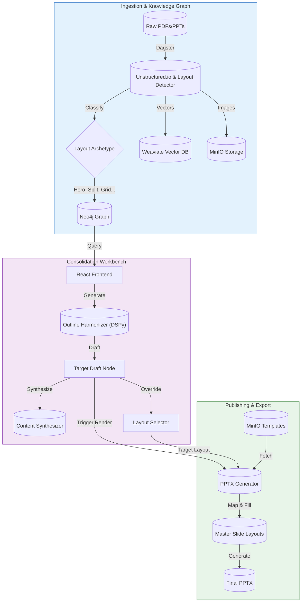

# Training Consolidation Workbench

This project supports consolidation of training material from multiple business units into a single, unified curriculum across four engineering domains: software, electrical, systems, and mechanical.

## High-level Architecture

- **Module 1: Ingestion (Dagster + Unstructured + MinIO)**
  - **Input**: Word, PowerPoint, and PDF files uploaded to MinIO (`source_docs` -> `training-content` bucket).
  - **Orchestration**: Dagster sensor (`course_upload_sensor`) detects new files.
  - **Extraction**:
    - `unstructured` extracts text and metadata.
    - `pdf2image` / `libreoffice` renders high-res images of slides/pages.
    - **Output**: JSON artifacts and PNG images stored in MinIO under `{course_id}/generated/`.

- **Module 2: The Cartographer (Neo4j + Weaviate + BAML)**
  - **Semantic Extraction**: A Dagster asset (`build_knowledge_graph`) processes ingested text.
  - **Graph Construction**:
    - Nodes: `Course`, `Section`, `Slide`, `Concept`.
    - Edges: `HAS_SECTION`, `HAS_SLIDE`, `TEACHES`.
  - **Vector Indexing**: Slide text is embedded and stored in **Weaviate** for semantic search.

- **Module 3: The Harmonizer (DSPy + Neo4j)**
  - **Concept Alignment**: DSPy (LLM) analyzes extracted concepts to find synonyms and duplicates.
  - **Harmonization**: Creates `CanonicalConcept` nodes in Neo4j to group disparate terms (e.g., "E-Stop" vs "Emergency Stop").

- **Module 4: The Workbench (FastAPI + React + Tailwind)**
  - **Backend (FastAPI)**:
    - Serves course hierarchies (`/source/tree`) and slide details (`/source/slide/{id}`).
    - Manages the "Consolidated Draft" state in Neo4j.
    - Triggers AI synthesis via Dagster GraphQL (`/synthesis/trigger`).
  - **Frontend (React)**:
    - **Source Browser**: Visualizes legacy content filtered by Engineering Discipline.
    - **Consolidation Canvas**: A Drag-and-Drop workspace to build the new curriculum.
    - **AI Synthesis**: Generates consolidated text from selected source slides.
    - **Layout Preservation**: Automatically detects slide layouts (Split, Hero, Grid) and maps them to master slides during export.

## Pipeline Workflow



## Generate Outline Feature

This feature allows users to automatically generate a consolidated curriculum skeleton (outline) from selected source courses. It leverages the underlying Knowledge Graph and AI harmonization to create a logical structure and suggest relevant content.

### Overview
The "Generate Outline" button triggers a process that synthesizes a new curriculum structure based on the content of the selected source materials. It identifies common themes, eliminates redundancies, and proposes a new hierarchy of sections, each populated with relevant slides.

### Preprocessed Inputs (Dagster)
The foundation for this feature is built by the Dagster ingestion and semantic pipelines:

1.  **Ingestion (`process_course_job`)**:
    -   Triggered by the `course_upload_sensor` when files are uploaded to MinIO.
    -   Extracts text and metadata from documents (PDF, PPTX, DOCX) using `unstructured`.
    -   Renders slide images.

2.  **Knowledge Graph Construction (`build_knowledge_graph`)**:
    -   **Asset**: `src/semantic/assets.py:build_knowledge_graph`
    -   **Process**:
        -   **Outline Extraction**: An LLM reads the full text of the course and extracts a hierarchical outline, creating `Section` nodes in Neo4j.
        -   **Concept Extraction**: An LLM analyzes *each slide* to extract key concepts (e.g., "PID Control", "Safety Interlocks"). These are stored as `Concept` nodes and linked to the `Slide` via `TEACHES` edges with a salience score (0.0 - 1.0).

3.  **Vector Indexing**:
    -   The text content of each slide is embedded and stored in **Weaviate** under the `SlideText` class to enable semantic search.

### Assets & Data Sources
-   **Neo4j**: Acts as the source of truth for the structural relationships (`Course` -> `Section` -> `Slide`) and semantic connections (`Slide` -[:TEACHES]-> `Concept`).
-   **Weaviate**: Stores vector embeddings of slide text for similarity search.

### Data Flow: Outlines & Concepts
To bridge the gap between raw slides and high-level planning, the system uses a "bottom-up" aggregation strategy:

1.  **Origin**:
    -   **Outlines**: Generated at the course level during ingestion.
    -   **Concepts**: Generated at the slide level during ingestion.
2.  **Aggregation**:
    -   Concepts are rolled up from **Slides** to their parent **Sections**.
    -   A Section's "Concept Summary" is derived by aggregating the concepts of all its contained slides, weighted by their salience scores.
3.  **Usage**:
    -   When generating a new outline, the `GeneratorService` fetches these "Section Outlines" (Title + Aggregated Concepts) from Neo4j.
    -   This provides the AI with a semantic summary of what each section teaches, rather than just a list of file names.

### Slide Selection Logic
The `GeneratorService` (`src/services/generator_service.py`) executes the following logic to create the new outline:

1.  **Fetch Source Outlines**:
    -   Retrieves the section structure and aggregated concepts for all selected source courses from Neo4j.

2.  **Harmonization (DSPy)**:
    -   The `OutlineHarmonizer` module uses an LLM to analyze the source outlines.
    -   It synthesizes a new, consolidated structure ("Target Sections") by merging overlapping topics and ordering them logically.
    -   Output: A list of Target Sections, each with a Title, Rationale, and a list of Key Concepts.

3.  **Matching (Weaviate)**:
    -   For each generated Target Section, the system takes its `Key Concepts` and performs a semantic search in **Weaviate**.
    -   **Filter**: The search is strictly filtered to only include slides from the user's selected source courses.
    -   **Result**: The top matching slides are linked to the Target Section as "Suggested Slides".

4.  **Unassigned Slides (Set Difference)**:
    -   The system calculates the set of **All Available Slides** (from selected sources) minus the set of **Assigned Slides** (those picked in step 3).
    -   Any slides that were *not* selected are grouped into a special "Unassigned / For Review" section, ensuring no source material is accidentally lost.

## Prerequisites

- **Docker**: To run MinIO, Neo4j, Weaviate, and Dagster.
- **Python 3.10+**: With `uv` recommended for dependency management.
- **Node.js 18+**: For the frontend.

## Setup & Installation

1.  **Start Infrastructure**
    ```powershell
    ./start_infra.ps1
    ```
    This spins up Docker containers for MinIO, Neo4j, Weaviate, and the Dagster Daemon.

2.  **Initialize Environment**
    Create a `.env` file in the root (see `.env.example`) with credentials for OpenAI/Ollama, Neo4j, etc.

3.  **Install Python Dependencies**
    ```powershell
    uv pip install -e .
    ```

4.  **Install Frontend Dependencies**
    ```powershell
    cd frontend
    npm install
    cd ..
    ```

## Running the Workbench

### 1. Start the Backend API
This serves the REST API for the frontend.
```powershell
uvicorn src.workbench.main:app --reload --port 8000
```

### 2. Start the Frontend
This launches the React UI (Vite).
```powershell
./run_frontend.ps1
# Or manually: cd frontend; npm run dev
```
Access the UI at **http://localhost:5173**.

### 3. Start Dagster (Optional for Dev)
If you need to inspect pipelines or trigger jobs manually.
```powershell
dagster dev
```

#### Auto-Enable the Ingestion Sensor
By default, the `course_upload_sensor` starts in a **stopped** state and must be enabled manually via the Dagster UI.

To have the sensor start **automatically enabled**, set the following environment variable before starting Dagster:
```powershell
$env:DAGSTER_SENSOR_DEFAULT_ENABLED = "true"
dagster dev
```

Or add it to your `.env` file:
```env
DAGSTER_SENSOR_DEFAULT_ENABLED=true
```

> **Note**: Changes to env vars require restarting Dagster to take effect.

## Data Management

### Ingesting Data (Priming the Sensor)
To upload source documents (`.pdf`, `.pptx`, `.docx`) from the `source_docs/` folder into the system:
```powershell
./prime_sensor.ps1
```
This triggers the ingestion pipeline automatically.

### Resetting Data
To **wipe all data** from Neo4j and Weaviate (useful for testing):
```powershell
./purge_data.ps1
```

### Debugging & Sync
If the UI shows blank images or missing courses, the Neo4j graph might be out of sync with MinIO storage. Run:
```powershell
py sync_graph.py
```
This scans MinIO and rebuilds the graph nodes to match actual files.

## Development Notes

- **Frontend Configuration**: If your backend runs on a different port, update `frontend/.env`:
  ```env
  VITE_API_URL=http://localhost:YOUR_PORT
  ```
- **LLM Configuration**: Ensure `OLLAMA_BASE_URL` or OpenAI keys are set in `.env` for Modules 2 & 3.

## LLM Context Limit Handling

All LLM-intensive operations are protected against context overflow. The system scales automatically based on your `OLLAMA_NUM_CTX` setting.

### Configuration

Set your LLM context size in `.env`:
```env
OLLAMA_NUM_CTX=8192   # Default (8K tokens)
OLLAMA_NUM_CTX=131072 # Production (128K tokens)
```

> **Note**: Larger context windows reduce chunking/batching but increase memory usage and latency.

### Protected Operations

| Operation | Strategy | File |
|-----------|----------|------|
| **Concept Harmonization** | Two-pass batching | `src/semantic/harmonization.py` |
| **Outline Generation** | Iterative pairwise merging | `src/dspy_modules/outline_harmonizer.py` |
| **Document Outline Extraction** | Sliding window with overlap | `src/semantic/extraction.py` |

### Strategy Details

#### 1. Concept Harmonization (Two-Pass Batching)
Groups synonymous concepts (e.g., "E-Stop" → "Emergency Stop").

- **Pass 1**: Processes concepts in batches sized to fit context
- **Pass 2**: Consolidates canonical names across batches to catch cross-batch synonyms

**Batch size formula**: `(OLLAMA_NUM_CTX - 3000) / 15` concepts

#### 2. Outline Generation (Iterative Pairwise Merging)
Merges section outlines from multiple courses into a unified structure.

- Groups outlines by Business Unit
- Merges pairs iteratively (like merge sort) until one result remains

**Max sections per merge**: `(OLLAMA_NUM_CTX - 6000) / 150`

#### 3. Document Outline Extraction (Sliding Window)
Extracts hierarchical outlines from large documents during ingestion.

- Splits document into overlapping chunks
- Extracts partial outlines from each chunk
- Merges by deduplicating on page numbers

**Chunk size**: `(OLLAMA_NUM_CTX - 4000) * 3` characters  
**Overlap**: 10% of chunk size

### ⚠️ Known Pitfalls

#### Outline Merging: Duplicate Sections from Different Chunks
When extracting outlines from chunked documents, the LLM may generate slightly different titles for the same section in different chunks. The merge logic uses `start_page` to deduplicate, so **the first occurrence wins**.

**Mitigation**: Increase context size to reduce chunking, or manually review extracted outlines.

#### Harmonization: Over-Aggressive Grouping
If the LLM groups related (but distinct) concepts together (e.g., "Git" + "Branch" + "Commit" → "Version Control"), the prompt may need tuning.

**Mitigation**: The harmonization prompt explicitly instructs the LLM to only group TRUE synonyms. If issues persist, clear harmonization data and re-run:
```powershell
$env:PYTHONPATH = "."; py scripts/clear_harmonization.py
```

#### Pairwise Merging: Groups Too Large to Merge
If two BU groups exceed the context limit when combined, they're kept separate and tried again in the next round. This may result in less optimal merging.

**Mitigation**: Increase context size or reduce source material per BU.

